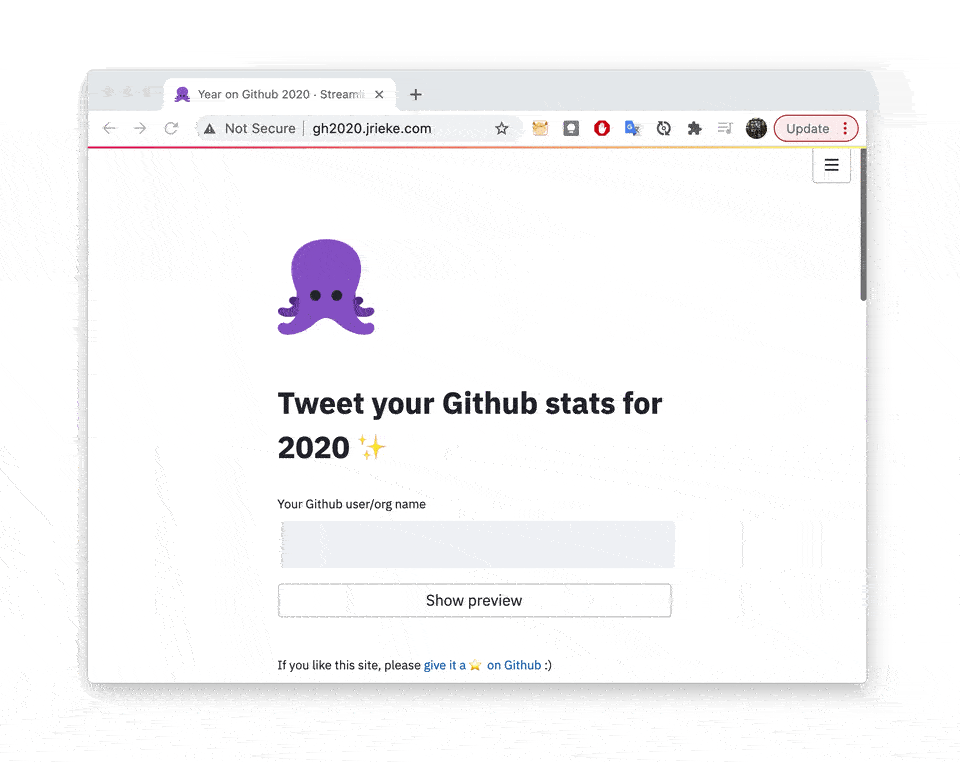

# Year on Github 🐙

[](http://gh2020.jrieke.com)

**Share your Github stats for 2020 on Twitter.**

This project contains a small web app that let's you share stats about your Github 
activity from last year. It's like Spotify's "year in review" but for Github. The app 
is built with [Streamlit](https://www.streamlit.io/), queries Github's API via 
[ghapi](https://ghapi.fast.ai/), and let's you share the generated stats directly on 
[Twitter](https://twitter.com/).

<br>

---

<h3 align="center">
    🎉 Try it out: <a href="http://gh2020.jrieke.com">gh2020.jrieke.com</a> 🎉
</h3>

---

<!-- <h3 align="center">
    🎉 Year on Github is now live! 🎉
    <br><br>
    Try it out: <br>
    <a href="http://gh2020.jrieke.com">gh2020.jrieke.com</a>
</h3> -->

<p align="center">
    <a href="http://gh2020.jrieke.com/"></a>
</p>

<br>

*For updates [follow me on Twitter](https://twitter.com/jrieke) and if you like this project, please [consider sponsoring](https://github.com/sponsors/jrieke) ☺️*

<br>

---

<br>

**Note: The steps below are only required if you want to work on the app. If you just want to use it, go [here](http://gh2020.jrieke.com/).**

## Installation

```bash
git clone https://github.com/jrieke/my-year-on-github.git
cd my-year-on-github
pip install -r requirements.txt
```

**Known issues**

- **Doesn't work with Python 3.8 and 3.9!** Both versions throw an error related to 
  ghapi/multiprocessing that I couldn't resolve yet 
  (`RuntimeError: An attempt has been made to start a new process before the current process has finished its bootstrapping phase` 
  and subsequently an `EOFError`). Please use Python 3.7 for now.

- [ghapi](https://ghapi.fast.ai/) has (as of 26 December 2020) a small bug in the 
  `paged` method (see [here](https://github.com/fastai/ghapi/issues/24)), which may 
  cause problems, therefore the commands above will install it from 
  [my fork](https://github.com/jrieke/ghapi) (you can also install it manually from 
  there with `pip install -U git+https://github.com/jrieke/ghapi`).


## Running locally

```bash
streamlit run app/main.py
```

Make sure to run always from the `my-year-on-github` dir (not from the `app `dir), 
otherwise the app will not be able to find the css file.

## Deploying to Heroku

First, [install heroku and login](https://devcenter.heroku.com/articles/getting-started-with-python#set-up). 
To create a new deployment, run inside `my-year-on-github`:

```
heroku create
git push heroku main
heroku open
```

To update the deployed app, commit your changes and run:

```
git push heroku main
```

# TODO

PRs are welcome! Please open an issue before you work on any of these.

- [ ] New stars for repos >40k stars are not properly calculated because the Github
  API only returns the first 40k stars. Improve this by using the current 
  stargazers_count to calculate/estimate the number of new stars.
- [ ] Maybe: Use stargazers_count in `query_repo` so it's not required to read the last
  page of stargazers. This requires to disable hashing for stargazers_count in 
  streamlit's cache function.